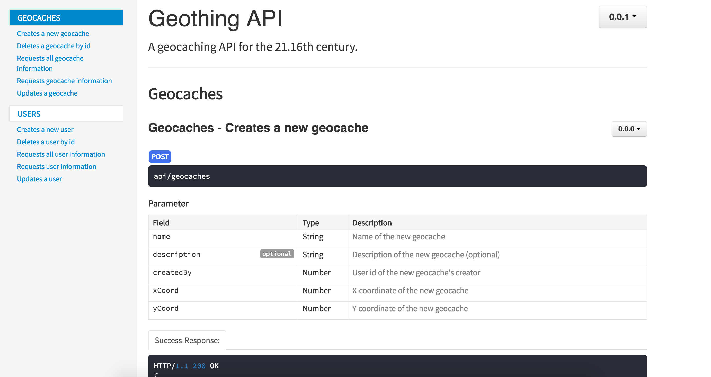

# GeoThing API
A REST-ful API powered by Express and NodeJS, with a MongoDB database and Mongoose ODM.

Current plan is to provide simple CRUD operations on Geocache, User and Log objects.

## Running the GeoThing API
- Ensure you have [NodeJS](https://nodejs.org/en/) installed.
- Install node packages.
`npm install`
- Run the API server.
`node server.js`
- Server defaults to port 8080. Point your browser to "http://localhost:8080/api" to test.

## Documentation
The Geothing API is beautifully documented by generating docs through [apiDoc](https://github.com/apidoc/apidoc).

To generate the documentation page, make sure you have apiDoc installed:  
`npm install apidoc -g`  

Then run the following command:  
`apidoc -i routes/ -o docs/`  

The docs should appear in the `/docs/` folder.

## Testing
Testing for the Geothing API is done through [Mocha](https://mochajs.org/) augmented by [Should](https://shouldjs.github.io/). Tests are contained within the `/api/test` folder. Refer to the [Mocha wiki](https://github.com/mochajs/mocha/wiki) and/or look at existing tests to get an idea of how to start testing.  

To run the tests, run the following command from within the `/api/tests` folder:  
`mocha {test file name}`  

Alternatively, run the following from within the `api` folder to run all available tests:
`mocha tests/`
